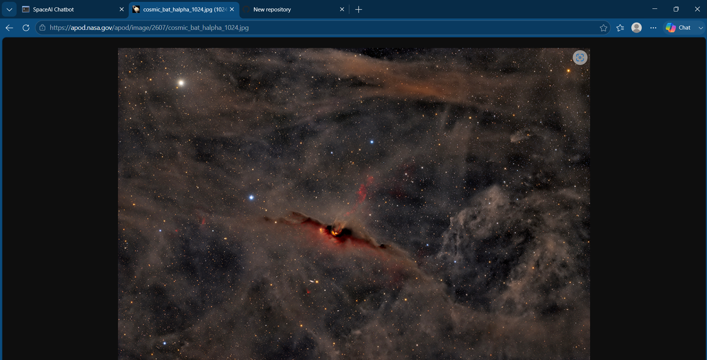
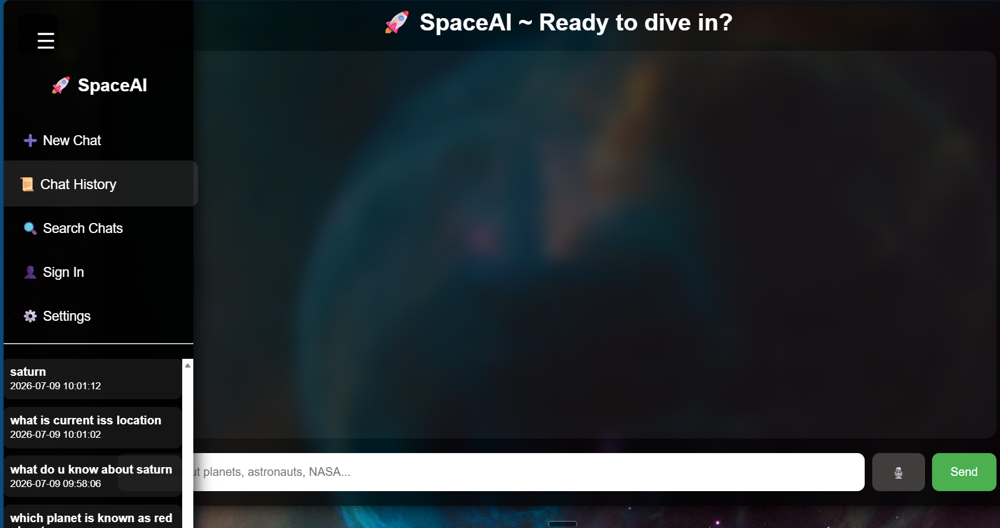
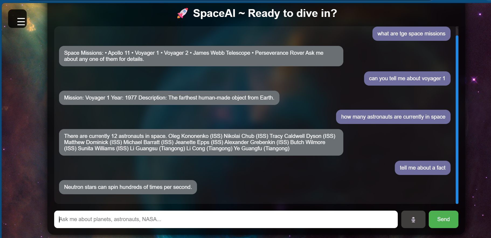

# Space AI Chatbot


An interactive AI-powered chatbot built using Python, Flask, HTML, CSS, and JavaScript that helps users explore space-related topics including planets, astronauts, NASA missions, ISS tracking, and SpaceX launches.

Space AI Chatbot is a Flask-based web application that allows users to explore planets, astronauts, space missions, and live space data through a conversational interface. It integrates multiple public APIs to provide real-time information while offering features such as voice interaction, chat history, and a modern responsive UI.


## Features

### Planet Information

-Retrieve facts about all planets
-Discover planet nicknames
-View the number of moons
-Check the distance from the Sun

### Astronaut Information
- Information about famous astronauts
- Historical space achievements
- Current astronauts in space

### Space Missions
- Mission details and descriptions
- Historical missions
- SpaceX latest launch information

### Live Space Data
- Current International Space Station (ISS) location
- Number of people currently in space
- NASA Astronomy Picture of the Day (APOD)

### Interactive Features
- Voice input using browser speech recognition
- Voice output using speech synthesis
- Typing animation
- Sidebar navigation menu
- New chat functionality

---

##  Technologies Used

### Backend
- Python
- Flask

### Frontend
- HTML
- CSS
- JavaScript

### Data Storage
- JSON files

### APIs
- NASA APOD API
- Open Notify API
- SpaceX API

### Browser Features
- Web Speech API
- Fetch API

## How It Works

User enters a query

↓

Flask receives the request

↓

The chatbot determines whether the request is related to planets, astronauts, NASA APOD, ISS location, or SpaceX missions.

↓

Relevant APIs or local JSON files are used.

↓

A formatted response is displayed in the chat interface.

##  Project Structure

```text
SpaceAI/
│
├── app.py
├── chatbot.py
├── api_handler.py
├── config.py
├── requirements.txt
├── README.md
│
├── data/
│   ├── planets.json
│   ├── astronauts.json
│   ├── missions.json
│   └── facts.json
│
├── templates/
│   └── index.html
│
├── static/
│   ├── style.css
│   └── script.js
│
└── screenshots/
```

---

## Installation

### Clone the repository

```bash
git clone https://github.com/summiyahyousaf/space-chatbot.git
```

### Navigate to the project directory

```bash
cd space-chatbot
```

### Install dependencies

```bash
pip install -r requirements.txt
```

### Run the application

```bash
python app.py
```

Open your browser and visit:

```text
http://127.0.0.1:5000
```

## 🎥 Project Demo

Watch a complete walkthrough of the application, including chatbot interaction, live NASA data, ISS tracking, voice features, and SpaceX mission search.

▶ Watch Demo
https://youtu.be/VxKg-zlevcA

## 📷 Screenshots


- Main chatbot interface
 
 
- NASA APOD response
  
  
- ISS Tracker
 
  
- Sidebar menu
  
 
- Space Missions
 



## Learning Objectives

This project was created to learn and practice:

- Python programming
- Flask web framework
- REST APIs
- JSON data handling
- Frontend and backend integration
- Asynchronous JavaScript
- Speech recognition
- Speech synthesis
- AI chatbot development principles

---

##  Future Improvements

Planned features for future versions:

Improve intent recognition

Store user chat history using a database

Add user authentication

Integrate additional NASA APIs

Improve chatbot responses using NLP techniques

Deploy the application online

---

##  APIs Used

### NASA APOD API
Used to retrieve NASA's Astronomy Picture of the Day.

### Open Notify API

Used to display the current ISS location and astronauts currently in space.

### SpaceX API
Used to retrieve mission and launch information.

##  Author

**Summiya Yousaf**

  BSAI student passionate about:
- Artificial Intelligence
- Machine Learning
- Space Technology

---

##  Project Status

Status:
Actively maintained

Current Version:
v1.0

This project is continuously being improved with additional AI and NLP capabilities.

##  License

This project is intended for educational and learning purposes.
