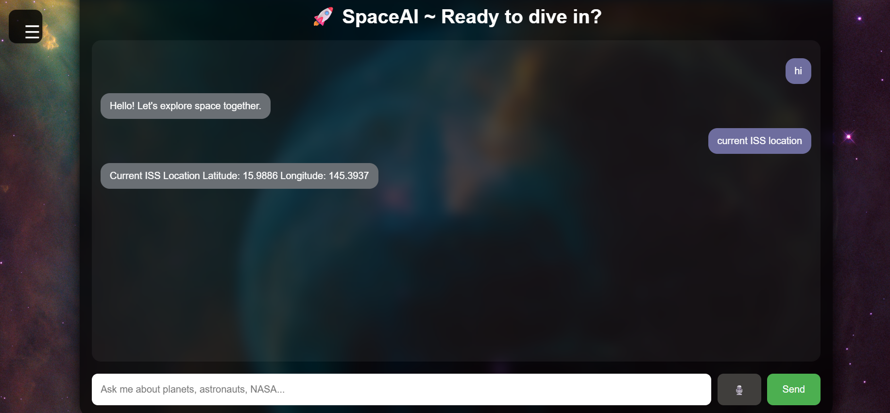

# Space AI Chatbot
### Intelligent Conversational Assistant for Space Exploration

<p align="center">
  
  
  
  
  
  
</p>

An interactive AI-powered chatbot built using Python, Flask, HTML, CSS, and JavaScript that helps users explore space-related topics including planets, astronauts, NASA missions, ISS tracking, and SpaceX launches.

Space AI Chatbot is a Flask-based web application that allows users to explore planets, astronauts, space missions, and live space data through a conversational interface. It integrates multiple public APIs to provide real-time information while offering features such as voice interaction, chat history, and a modern responsive UI.

## Table of Contents

- [Project Overview](#project-overview)
- [Project Objectives](#project-objectives)
- [Features](#features)
- [Technology Stack](#technology-stack)
- [Application Workflow](#application-workflow)
- [System Architecture](#system-architecture)
- [Project Demo](#project-demo)
- [Application Screenshots](#application-screenshots)
- [Machine Learning Pipeline](#machine-learning-pipeline)
- [Project Structure](#project-structure)
- [Installation](#installation)
- [Learning Objectives](#learning-objectives)
- [APIs Used](#apis-used)
- [Future Improvements](#future-improvements)
- [Developer](#developer)
- [License](#license)

## Features

### Planet Information

-Retrieve facts about all planets
-Discover planet nicknames
-View the number of moons
-Check the distance from the Sun

### Astronaut Information
- Information about famous astronauts
- Historical space achievements
- Current astronauts in space

### Space Missions
- Mission details and descriptions
- Historical missions
- SpaceX latest launch information

### Live Space Data
- Current International Space Station (ISS) location
- Number of people currently in space
- NASA Astronomy Picture of the Day (APOD)

### Interactive Features
- Voice input using browser speech recognition
- Voice output using speech synthesis
- Typing animation
- Sidebar navigation menu
- New chat functionality

---

##  Technologies Used

### Backend
- Python
- Flask

### Frontend
- HTML
- CSS
- JavaScript

### Data Storage
- JSON files

### APIs
- NASA APOD API
- Open Notify API
- SpaceX API

### Browser Features
- Web Speech API
- Fetch API

## How It Works

User enters a query

↓

Flask receives the request

↓

The chatbot determines whether the request is related to planets, astronauts, NASA APOD, ISS location, or SpaceX missions.

↓

Relevant APIs or local JSON files are used.

↓

A formatted response is displayed in the chat interface.

##  Project Structure

```text
SpaceAI/
│
├── app.py
├── chatbot.py
├── api_handler.py
├── config.py
├── requirements.txt
├── README.md
│
├── data/
│   ├── planets.json
│   ├── astronauts.json
│   ├── missions.json
│   └── facts.json
│
├── templates/
│   └── index.html
│
├── static/
│   ├── style.css
│   └── script.js
│
└── screenshots/
```

---

## Installation

### Clone the repository

```bash
git clone https://github.com/summiyahyousaf/space-chatbot.git
```

### Navigate to the project directory

```bash
cd space-chatbot
```

### Install dependencies

```bash
pip install -r requirements.txt
```

### Run the application

```bash
python app.py
```

Open your browser and visit:

```text
http://127.0.0.1:5000
```

## 🎥 Project Demo

Watch a complete walkthrough of the application, including chatbot interaction, live NASA data, ISS tracking, voice features, and SpaceX mission search.

▶ Watch Demo
https://youtu.be/VxKg-zlevcA

## 📷 Screenshots

### NASA APOD Response

<p align="center">
  
</p>

### ISS Tracker

<p align="center">
  
</p>

### Sidebar Menu

<p align="center">
  
</p>

### Space Missions

<p align="center">
  
</p>


## Learning Objectives

This project was created to learn and practice:

- Python programming
- Flask web framework
- REST APIs
- JSON data handling
- Frontend and backend integration
- Asynchronous JavaScript
- Speech recognition
- Speech synthesis
- AI chatbot development principles

---


##  APIs Used

| API            | Purpose                      |
| -------------- | ---------------------------- |
| NASA APOD      | Astronomy Picture of the Day |
| Open Notify    | ISS Tracking                 |
| SpaceX         | Launch Information           |
| Web Speech API | Voice Recognition            |


# Future Improvements

- Integrate Large Language Models (Gemini/OpenAI) for more intelligent conversations.
- Improve intent recognition using NLP techniques.
- Add conversation memory for personalized interactions.
- Integrate additional NASA and ESA APIs.
- Implement user authentication and persistent chat history.
- Migrate from JSON storage to PostgreSQL or MongoDB.
- Containerize the application using Docker and deploy to the cloud.
- Enhance security, logging, and automated testing.
- 
##  Developer

**Summiya Yousaf**

Bachelor of Science in Artificial Intelligence

Air University Islamabad

### Interests

- Artificial Intelligence
- Machine Learning
- Healthcare AI
- NLP
- Computer Vision

### 🔗 Connect with me

- GitHub: https://github.com/summiyahyousaf
- LinkedIn: https://www.linkedin.com/in/summiya-yousaf-24411534a/
  
 ##  License

This project is licensed under the MIT License.


⭐ If you found this project interesting, consider giving it a star!

